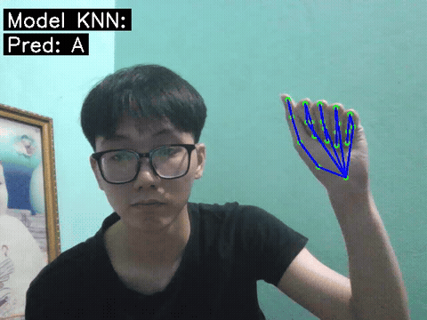
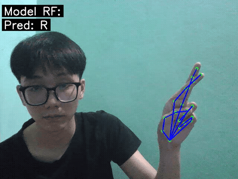

# Sign-Language-Recognition
## Nhận diện bảng chữ cái Mỹ qua ngôn ngữ ký hiệu (không bao gồm ký tự J và Z)

Hệ thống nhận diện ngôn ngữ ký hiệu tay theo thời gian thực sử dụng **MediaPipe Tasks** và **Machine Learning**
Ứng dụng sử dụng camera để phát hiện bàn tay và dự đoán ký tự tương ứng trong bảng chữ cái (không bao gồm ký tự J và Z)

---

### Demo

[Xem video full] (demo/...)

---

### Tính năng (Features)

- Phát hiện bàn tay theo thời gian thực bằng MediaPipe Tasks, trích xuất đặc trung từ 21 điểm trên bàn tay
- Huấn luyện các mô hình học máy:
    - K-Nearest Neightbors (KNN)
    - Support Vector Machine (SVM)
    - Random Forest (RF)
- Nhận diện các ký tự bảng chữ cái trực tiếp từ webcam
- Hỗ trợ lưu video demo

---

### Công nghệ sử dụng (Technologies)

- Python
- OpenCV
- MediaPipe Tasks
- Scikit-learn
- Numpy, Pandas

---

### Cấu trúc project (Project Structure)

D:.
│   hand_landmaker.task
│   README.md
│
\---data
│   │   data.csv
│   │   X_test.pkl
│   │   X_train.pkl
│   │   y_test.pkl
│   │   y_train.pkl
│   \---images
│       ├───A
│       ├───B
│       ├───C
│       ├───D
│       ├───E
│       ├───F
│       ├───G
│       ├───H
│       ├───I
│       ├───K
│       ├───L
│       ├───M
│       ├───N
│       ├───O
│       ├───P
│       ├───Q
│       ├───R
│       ├───S
│       ├───T
│       ├───U
│       ├───V
│       ├───W
│       ├───X
│       └───Y
+---demo
│       knn_demo.avi
│       rf_demo.avi
│       svm_demo.avi
│
+---models
│       model_knn.pkl
│       model_rf.pkl
│       model_svm.pkl
│       scaler.pkl
│
+---src
│       collect_data.ipynb
│       model_knn.ipynb
│       model_rf.ipynb
│       model_svm.ipynb
│       preprocess.ipynb
│       test_model.ipynb
│
\---utils
    │   features.py
    │
    \---__pycache__
            features.cpython-314.pyc

---

### Cách hoạt động (How It Works)

1. Thu thập dữ liệu từ camera (collect_data.ipynb)
2. Trích xuất 21 điểm đặc trưng của bàn tay bằng MediaPipe (collect_data.ipynb)
3. Chuẩn hóa và xử lý dữ liệu (preprocess.ipynb)
4. Huấn luyện các mô hình học máy (model_knn.ipynb, model_rf.ipynb, model_svm.ipynb)
5. Dự đoán ký tự theo thời gian thực (test_model.ipynb)

---

### Các mô hình sử dụng (Models)

- KNN: Đơn giản, dễ triển khai
- SVM: Độ chính xác cao
- Random Forest: Ổn định, ít bị nhiễu

---

### Hạn chế ()

- Không nhận diện được các ký tự động (J, Z)
- Độ chính xác phụ thuộc nhiều vào góc quay, hướng bàn tay
- Chỉ hỗ trợ 1 bàn tay

---

### Hướng phát triển thêm (Future Improvements)

- Hỗ trợ nhận diện ký tự động 
- Tăng độ chính xác bằng dữ liệu đa dạng hơn
- Hỗ trợ nhận diện nhiều bàn tay